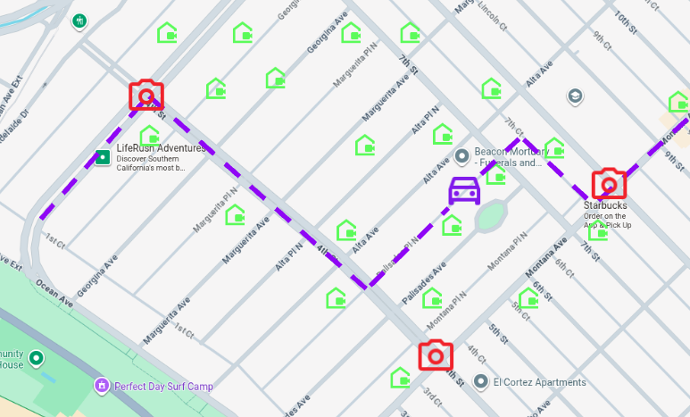
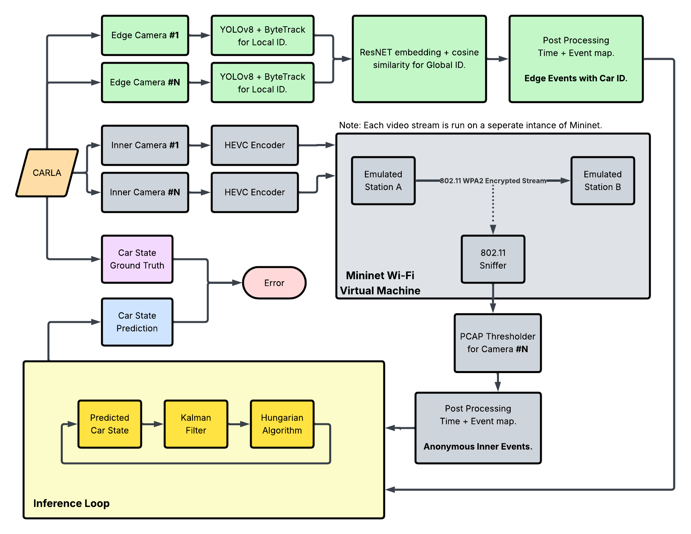
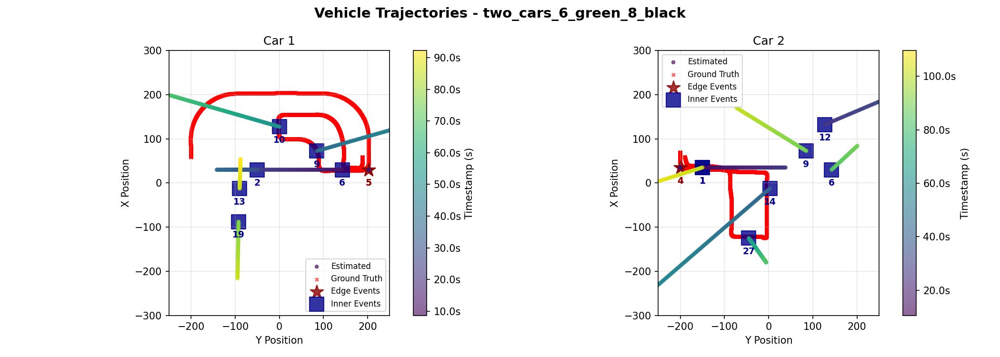
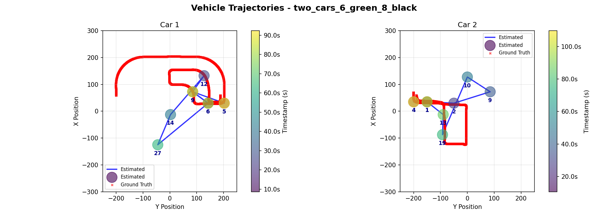
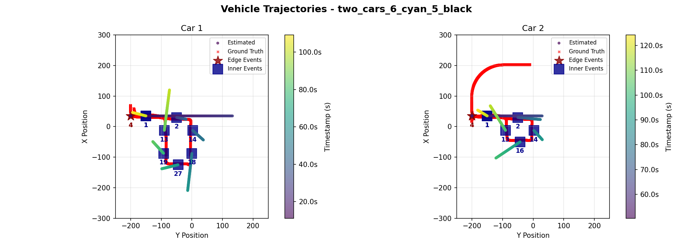
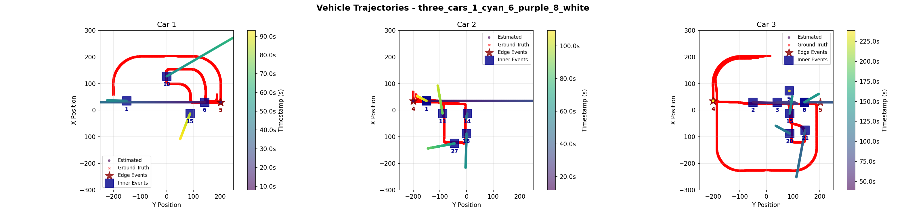
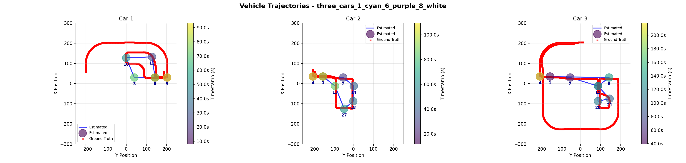

# **Urban Traffic Inference  Perimeter Vision & Encrypted-Camera Side-Channel Extraction**

  
---

## 👥 **Team**

- **Amy Lee** (siuyuetlee@ucla.edu, [GitHub](https://github.com/Harukk246))
- **Katherine Sohn** (katherinesohn@ucla.edu, [GitHub](https://github.com/katherinesohn)) 
- **Vamsi Eyunni** (veyunni@ucla.edu, [GitHub](https://github.com/skyguy126))

---

## 👥 **Mentors**

- **Gaofeng Dong** (gfdong@ucla.edu)
- **Pragya Sharma** (pragyasharma@ucla.edu)

---

## 📝 **Abstract**

Modern cities face a tension between traffic monitoring needs and privacy concerns. This project explores vehicle tracking in urban zones by fusing perimeter vision with encrypted-camera side-channel signals. We leverage entry/exit detections from edge cameras (YOLOv8 + ByteTrack + OSNet ReID for multi-camera association) and interior motion cues inferred from WiFi packet traces (LSTM-based bitrate analysis) to estimate vehicle counts, locations, and dwell times without direct observation of private feeds. Implemented in the CARLA simulator with Mininet-WiFi emulation, our Kalman-filter fusion system tracks multiple vehicles through realistic urban scenarios, achieving trajectory estimates within acceptable error bounds while operating near real-time. Results demonstrate that side-channel data can meaningfully augment visual tracking when carefully synchronized and fused, opening a new avenue for privacy-conscious urban sensing, though with important caveats about appearance variability, temporal alignment, and ethical deployment.

---

## 📑 **Slides**

- [Midterm Checkpoint Slides](https://docs.google.com/presentation/d/1X-M2zomr7aMnQWdz8OJdX9qPV1sSsXszmZ0EHS2_K9M/edit?usp=sharing)  
- [Final Presentation Slides](https://docs.google.com/presentation/d/14e4P2keh30SPoivBp-G8eDYCar3hYOaEy6AgSDjk5yw/edit?usp=sharing)

---

# **1. Introduction**

Urban environments increasingly rely on camera networks for traffic management, safety, and city planning. Yet cities face a fundamental tension: comprehensive visual surveillance enables effective situational awareness but raises serious privacy concerns, while privacy-preserving approaches often sacrifice visibility and utility. This project explores a middle ground by asking: Can we maintain awareness of vehicles moving through an urban zone using only perimeter cameras and indirect signals from interior private feeds?

### **1.1 Motivation & Objective**

Urban mobility applications (e.g. congestion control, emergency response) require knowing how many vehicles are in a given area, where they are, and how long they dwell. Today’s cities often rely on fixed cameras or sensor networks, but full coverage is impractical and raises privacy issues. For instance, automated license plate reader (ALPR) systems can log vehicles entering or exiting a town, but cannot monitor movements once inside and pose serious privacy concerns (Automated License Plate Readers, n.d.). Our objective is to maintain real-time awareness of vehicles in a city zone without blanket surveillance. We propose to achieve this by fusing perimeter camera vision with encrypted-camera side-channel data. Encrypted video streams, such as those from private interior cameras, inadvertently leak information through their bitrate patterns, which correlate with scene motion (Apthorpe et al., 2017). By monitoring these side-channel signals, we can infer when and where vehicle motion occurs inside the zone, then combine that with multi-vantage perimeter detections to track vehicles continuously. This approach is important because it could enable traffic monitoring that is less intrusive yet effective in complex urban environments.

### **1.2 State of the Art & Its Limitations**  

Current solutions for city-scale vehicle tracking fall short either in coverage or privacy. Surveillance camera networks with multi-camera tracking algorithms have been studied extensively. For example, the CityFlow benchmark demonstrated tracking vehicles across 40 cameras in a city environment (Tang et al., 2019). However, such systems assume extensive camera deployment with open video feeds, which is costly and invasive. Many cities instead deploy ALPR cameras at key points to record license plates providing entry/exit logs and can reveal travel patterns (Automated License Plate Readers, n.d.), but fail to continuously localize vehicles. Another line of work uses IoT and wireless signals: Researchers have shown that even when video feeds are encrypted, the network traffic rates can indicate activity. For instance, Apthorpe et al. found that a home security camera’s encrypted traffic spikes when it detects motion or is being viewed (Apthorpe et al., 2017). Similarly, Ji et al. demonstrated that user presence and daily routines can be inferred from smart camera network traffic (Ji et al., 2018). Li et al. extended this to show that even fine-grained activities (e.g. moving, eating, etc.) could be distinguished via encrypted video stream patterns (Li et al., 2016). These studies highlight a privacy loophole: the bitrate of compressed video is strongly influenced by scene motion. To mitigate this, some systems like Microsoft’s Visor have proposed padding or shaping video traffic to mask the bitrate variations (Shokri et al., 2019). In practice, however, most cameras do not employ such padding, and the side-channel remains available. No existing traffic-monitoring approach has combined these modalities: both vision and encrypted traffic for multi-vehicle tracking. The state-of-art either uses direct observation (many cameras or sensors) or coarse traffic counts, but cannot both protect privacy and maintain continuous tracking. This gap motivates our approach to fuse sparse, high-trust data (perimeter video feeds) with ubiquitous, low-trust signals (encrypted network feeds) to overcome these limitations.

### **1.3 Novelty & Rationale**

Our approach is novel in that it treats encrypted camera traffic as a sensor for vehicle tracking. This is enabled by the key insight that encrypted camera streams (which one cannot and should not decrypt) still reveal some information through their network traffic patterns. When a video encoder compresses a scene with motion, the bitrate increases; when the scene is static, bitrate drops. An observer monitoring only packet statistics (not content) can leverage these properties to infer that something moved without ever seeing the video. We repurpose this side-channel phenomenon, traditionally studied as a privacy vulnerability, as a useful sensor for vehicle tracking.

Prior research on encrypted traffic focused on privacy attacks or anomaly detection, whereas we repurpose the phenomenon effectively using private cameras’ data rates to “peek” at motion on streets without seeing video content. This has not been explored before in multi-target tracking. We then fuse this side-channel with traditional vision-based tracking at the perimeter, incorporating both types of motion events into a unified tracking model. Each vehicle entering the zone is initialized via a perimeter camera detection, and thereafter updates its state either when seen by another edge camera or when triggered by interior side-channel events. 

We also implement a multi-camera appearance matching technique using deep learning: by extracting appearance embeddings (e.g. using a OsNET CNN) for vehicles at edge cameras, we perform cross-camera re-identification based on cosine similarity (Zhou et al., 2019). This improves the consistency of vehicle identities across different camera views. The rationale is that combining these complementary sources will succeed where each alone fails: perimeter cameras give reliable IDs, temporal position, and entry/exit times but no internal visibility, while interior encrypted feeds give continuous presence hints without identification. Together, they can maintain a coarse but continuous track of each vehicle. In summary, the novelty lies in the multimodal fusion of vision and encrypted-network signals for tracking, and in demonstrating a working prototype of such a system in a realistic simulator.

### **1.4 Potential Impact**  

This project has the potential to influence the design of future smart-city sensing infrastructure by suggesting that useful situational awareness can be obtained without blanket CCTV coverage. Cities could leverage privately owned cameras as privacy-preserving sensors, only tapping metadata like traffic rates rather than live video feeds. This alleviates the need for new hardware installation, and allows monitoring in sensitive areas where video is restricted. Technically, the approach opens up a new avenue in multimodal tracking, fusing conventional sensors with unconventional side-channels. It also may inform privacy policy; by highlighting that encrypted camera streams still convey significant information, our work may encourage stricter standards (e.g. mandatory traffic shaping) or conversely, demonstrate a constructive use-case of the side-channel (improving public services without additional surveillance). In domains beyond traffic, the concept could be applied to track occupancy in smart buildings or public spaces using encrypted IoT data, balancing utility and privacy. Finally, our system contributes to embedded and IoT research by showcasing inference under resource constraints; using minimal additional hardware (just a WiFi sniffer and a few cameras) to achieve a complex sensing task.

### **1.5 Challenges**  

Implementing the proposed system presents several challenges. 

- Data Fusion: The system must reliably associate events from two very different sources. Encrypted traffic cues are noisy and lack direct identifiers. Determining which vehicle caused it is non-trivial, especially if multiple vehicles are in range. We mitigate this with assumptions listed in the below section and by probabilistic association (using distance-based soft assignments in the Kalman filter). 
- Timing and Synchronization: The perimeter and interior data streams must be synchronized to within a fraction of a second. We run CARLA in synchronous mode and timestamp all events, but in the real world network delays could desynchronize signals.
- Kalman Filter Tuning: We maintain separate noise models for edge vs. interior observations (edge cameras give precise location, interior side-channel gives coarse info). Tuning these noise covariances is challenging. If interior data is weighted too high, tracking will jitter; too low and interior cues might be ignored.
- Multi-Target Scalability: As vehicle count grows, the association problem (which car triggered an interior event) becomes harder. An optimal assignment (we considered the Hungarian algorithm) is needed when multiple events and vehicles coincide. Ensuring the tracker doesn’t mistakenly merge or swap tracks under crowded conditions is difficult.
- Appearance Variability: Our cross-camera re-identification uses visual appearance embeddings to maintain a global vehicle identification across different edge cameras. Variations in lighting or similar-looking cars can lead to ID switches. 
- Privacy and Ethics: On a non-technical front, using side-channel data raises ethical questions: even if we are not decrypting videos, inferring activity from someone’s camera feed could still have privacy implications. We must consider how to deploy such a system transparently and with consent.

### **1.6 Metrics of Success**  

Our success criteria is event error count. A non-successful event includes a false positive, false negative, or a mis-classified event (an event that was triggered by a different car than it was attributed to). Because of time constraints, this metric is evaluated heuristically, but could be automatically calculated from ground truth with further processing of ground truth data. 

---

# **2. Related Work**

Our project builds upon and intersects multiple research threads, including multi-camera tracking, network traffic analysis for inference, and privacy-preserving sensing. In this section, we review representative prior works in these areas, highlighting how they relate to our solution and what gaps remain. Furthermore, reference citations provided in Section 6.

- Multi-Target Multi-Camera Tracking: Tracking objects across multiple camera views is a well-studied problem in computer vision. Tang et al. introduced the CityFlow dataset to push the state-of-the-art in city-scale vehicle tracking and re-identification (Tang et al., 2019). Their benchmark consists of synchronized video from 40 cameras and has spurred development of algorithms that associate vehicles across disjoint views. Typical approaches (e.g. in the AI City Challenge) combine motion modeling with appearance re-identification where vehicles are matched between cameras by comparing visual features or “fingerprints.” For example, the baseline in CityFlow used deep CNN features and simple tracking to link cars across intersections (Tang et al., 2019). While these methods perform well with comprehensive camera coverage, they assume full access to video feeds from all cameras. In contrast, our scenario lacks interior camera video (only encrypted streams), making standard multi-camera tracking infeasible. We do adopt ideas from this field: our system uses appearance embeddings (from a OsNet-based model) to recognize the same vehicle at different edge cameras, similar to re-identification in prior work. The gap is that no existing multi-camera tracking technique incorporates side-channel data; they all rely on direct imagery. Thus, our work extends multi-camera tracking into a new modality.
- Encrypted Traffic Inference: A growing body of research has examined what can be inferred from encrypted IoT traffic. Apthorpe et al. (NDSS 2017) showed that the network traffic rates of smart home devices betray user activities (Apthorpe et al., 2017). In particular, they noted that a Nest security camera’s upload traffic spiked whenever it detected motion, effectively allowing an eavesdropper to know when someone is in the room or when the owner is watching the feed. Similarly, Li et al. investigated surveillance systems and showed that different types of human activities produce distinct traffic patterns in the encrypted video stream (Li et al., 2016). For instance, a fast-moving object vs. a stationary scene lead to different bitrate “signatures,” and an attacker could classify them. Taking this further, Ji et al. studied smart cameras and found that periodic patterns and bursts in encrypted video streams correlate with events like a person walking by, calling this system HomeSpy (Ji et al., 2018). HomeSpy demonstrated user presence detection in a smart home by analyzing an encrypted camera’s bitrate over time. These prior works treat the leakage of information as a privacy vulnerability, but this concern does not apply to us since we exclusively utilize camera feeds that display areas outside the home, namely videos of public roads. Our project thus repurposes the core insight of these studies for a positive use-case. We are not the first to do side-channel motion tracking; Tian et al. (TIFS 2021) present a method for motion detection and object tracking directly on encrypted video bitstreams. They operate in the compressed domain (without decrypting) to detect moving objects and even use Kalman filters for multi-object tracking. However, their scenario assumes the processor has access to the encrypted video data (just not the key), and they focus on cloud processing of video while preserving privacy. In contrast, our approach assumes we cannot access the video at all for inner-zone cameras. This makes our setting more restrictive; we only get a binary or analog signal of “something moved at camera `X` at time `t`.” The gap remains in how to integrate side-channel inferences with visual tracking, which is precisely what our system attempts. 
- Sensor Fusion and Tracking: Our work is also related to general multi-sensor fusion for tracking, a common theme in embedded systems. Techniques like the Kalman Filter and its variants (Extended KF, Particle Filters) are widely used to integrate information from different sensors. For example, in autonomous vehicles, data from cameras, LIDAR, and radar are fused to track obstacles. We leverage a classic Kalman Filter for combining our two “sensors” (vision and encrypted traffic). The use of Kalman filtering with an assignment algorithm for multi-object tracking is a proven approach (e.g. SORT algorithm by Bewley et al.). SORT showed that even a simple KF + Hungarian assignment can achieve near state-of-the-art tracking on benchmark datasets, which gives credence to our choice of using a similar paradigm. The challenge in our fusion is the asymmetry of the sensors: one provides precise coordinate measurements (edge camera seeing a car) but only at sparse intervals; the other provides continuous but unlocalized and anonymous signals (a motion event in some camera’s view). Prior sensor fusion research doesn’t directly address this odd pairing. We had to devise a custom association logic (a soft assignment using distance and uncertainty) instead of a standard 1-to-1 matching, due to the possibility that an interior motion event could belong to any of multiple active tracks. This is a gap our work begins to fill, though more advanced data association (e.g. Joint Probabilistic Data Association) from the literature could further improve our system.
- Privacy-Preserving Traffic Monitoring: There is relatively little prior work on traffic monitoring that explicitly tries to preserve privacy by design. Most smart-city projects simply deploy cameras or connected vehicle sensors and then deal with privacy via policy. One related concept is using non-visual sensors like wireless signals or audio to detect vehicles. Researchers have explored using WiFi doppler or signal reflections to sense moving objects (vehicle or human) without cameras (Mosharaf et al.). These approaches align with ours by using indirect sensing to avoid visual privacy issues, but require specialized hardware or access to signal waveforms (e.g. Channel State Information). Our method piggybacks on existing camera infrastructure and standard encryption traffic. We did not find prior work that uses encrypted camera feeds to monitor vehicle traffic in an urban setting. It bridges a gap between two fields: computer vision (which rarely considers encrypted data) and network security (which rarely deals with multi-object tracking). By doing so, we hope to inspire follow-up research that further refines such side-channel fusion, or that develops countermeasures if such tracking is deemed too invasive.

In summary, while we draw on ideas from related work in multi-camera tracking, side-channel analysis, and sensor fusion, our system addresses a unique combination of these problems that has not been fully explored in the literature. This positions our work as a stepping stone toward more integrated, privacy-conscious urban sensing solutions.

---

# **3. Technical Approach**

TODO: NEED MORE FIGURES!!!

### **3.1 Assumptions & Proposed Solutions**

Throughout this project, we make the following assumptions:

- Traffic is sparse: at any given time, only zero or one car occupies any camera's field of view. This pushes the edge case where multiple cars pass a single camera at one time, and two events must be detected, out of scope. In future work, this assumption can be lifted by inspecting the difference in encrypted network traffic when one car versus multiple cars pass. For example, if the disturbance size is found to be dependent upon the number of cars in the camera's view, this can be probabilistically added into the algorithm to trigger two anonymous events instead of one. 
- No two cameras' fields of view overlap: no two cameras will pick up the same event. This assumption is reasonable because we are looking for coarse traffic tracking. Future work could be robust to this by inferring based on camera proximity and field of view to throw out events that are likely duplicates. 
- Each camera transmits only to its associated access point, with no other traffic on that link; therefore all WiFi traffic observed on that network originates from the camera. In future work, this assumption could be relaxed by making the simulated WiFi network more robust, such as positioning packet sniffers between cameras and using triangulation to determine the camera from which the packets originate from. This would also decrease the deployment costs of such a system by decreasing the number of packet sniffers needed.  
- The only movement in a camera is assumed to be triggered by a car. Involved noise filtering, such as distinguishing between a person and a car walking past a camera, is not handled for inner camera events. For edge cameras, the computer vision algorithms used automatically handle most cases of such noise. Essentially, however, the CARLA environment is static except for natural ambiance and car movement. 
- The WiFi sniffer is positioned so it is within range of only a single camera/access-point pair at any given time, preventing capture of unrelated over-the-air traffic. This assumption is made to control our system, but future work could look to detect and filter out such noise.
- We assume minimal or no network level packet loss, whereas in reality packet losses are quite common, especially video streams over UDP.
- The multi-vantage identification system generates embeddings solely from vehicle appearance without incorporating temporal or spatial metadata. It performs reliably when vehicle colors differ, but error rates may increase when vehicles have similar appearances. In our project, we use only one model of car (Toyota Prius), selected due to its medium size and prevalence in the real world. Cars are differentiated solely on a color basis, but future work could use license plate detection or other differentating features to more reliably track cars at edge nodes. 
- All simulations are run in CARLA's synchronous mode. This was found to be necessary in order to synchronize the cars' movement with camera capture, so that videos would correctly show the car moving across the camera in "real time". While we were not able to investigate this requirement deeply due to time constraints, we hypothesize that this is necessary due to system constraints, as camera capture takes significant time compared to an asynchronous tick. The main benefit of asynchronous mode is more robust car movement with respect to acceleration, deceleration, and turning, but we decided that we could safely forego these features for our purposes. This is because for both edge and inner cameras, we are simply detecting a car's presence in a camera's view, and more precise aspects about its movement (other than a single instantaneous velocity) are not included in calculations. 
- All cars ignore traffic lights, and move at a relatively constant velocity. This assumption could be relaxed by introducing further uncertainty in calculations. In the future, actual data of traffic light patterns could even be integrated as further "ground-truth" data to improve tracking results.
- The edge camera multi-vantage tracking approah uses a hardcoded value for the cosine similarity threshold. This value should be dynamically derived based on current scene and environment conditions to ensure stability between different CARLA maps and vehicles.
- This project uses deterministic vehicle route mapping to further allow control for result replication.
- Inner cameras were placed overhead to allow for cleaner data collection, but this is often not representative of reality. Robustness to camera placement should be explored in future work. 

### **3.2 System Architecture**


The system architecture is organized into three major subsystems: edge-camera perception, inner-camera wireless side-channel sensing, and a central fusion/inference module. Edge cameras handle visual detection, tracking, and global ID assignment, while inner cameras contribute anonymized event streams derived from encrypted Wi-Fi traffic. Events are processed by a final inference loop, which is implemented either with a Kalman+Hungarian tracker as shown or a Graph Optimization Problem approach. The final layer integrates these heterogeneous event sources into coherent vehicle position inferences.

### **3.3 Data Pipeline**

#### CARLA Setup

The CARLA simulator is instianted via the [pylot docker container](https://github.com/erdos-project/pylot) and all ports are exposed on the host. The simulator is run within a docker container to ensure reproducability and easy sharing of dependencies. All ephermal code and data collection is executed on the host itself.

#### Car Control & Scenario Generation

Vehicle trajectories are generated deterministically to ensure reproducible experiments across trials. The system employs a multi-point route structure where each vehicle follows spawn → interior → destination waypoints, with the spawn and destination points constrained to lie outside the monitoring zone (perimeter) and the interior waypoints required to pass through it. This design guarantees that every vehicle both enters and exits the region of interest, enabling comprehensive evaluation of entry detection, interior tracking, and exit confirmation. For ease of developent, all waypoints in routes are selected from the list of legitimate spawn points specified by CARLA, since these represent locations that are well-aligned with road lanes, minimizing undesired car behaviors. 

Each vehicle is controlled by a CARLA BehaviorAgent, a rule-based local planner that wraps the Traffic Manager's low-level steering/throttle control with higher-level waypoint-following logic. Since the version of CARLA's BehaviorAgent does not provide an end method as later versions do, we detect reaching a destination via catching a queueing error that the BehaviorAgent triggers when the car approaches its destination. This ad hoc solution was found to be extremely deterministic and producing useful behavior for our project's standards.  

For multi-vehicle scenarios, any combination of pre-defined routes can be specified when running the `multi_car_route.sh` script. Colors are deterministically assigned from a restricted set consisting of high contrast colors. 

Storage of route files (written by the `one_car_route.py` with the appropriate flags, or manually) provides a certain reproducibility guarantee, limited by the variation in behavior due to the slow synchronous ticks. CARLA's BehaviorAgent may make slightly different decisions in steering aggression between runs, but car paths throughout the world are deterministic between runs and across machines. 

#### Camera Capture


Static RGB cameras are placed at fixed, repeatable poses so every trial observes identical viewpoints; controlled camera geometry improves cross-run comparability and is standard practice in multi-camera tracking benchmarks. Each camera is assigned a unique ID to be tracked throughout data processing. Cameras sample at 20 FPS with 1280×720 resolution and a 90° field of view to balance spatial detail with real-time throughput (similar rates are used in KITTI/nuScenes to match perception pipelines) (Caesar et al., 2020). Frames arrive as raw bytes and are first buffered in per-camera queues to decouple acquisition from storage, a common technique in real-time vision systems to prevent frame drops when I/O stalls.

Frames are compressed on the fly with HEVC fed via stdin. Piping raw frames directly into the encoder avoids intermediate disk writes and aligns with recommendations from the video systems literature for reducing latency and preserving quality in real-time capture (e.g., FFmpeg-based pipelines in robotics and teleoperation studies). Queue draining is synchronized with the simulator tick.

Vehicle poses are logged once per tick in world coordinates (x, y; ground plane), assuming a flat road surface. Pre- and post-padding with zeros yields a fixed-length trajectory per vehicle, which simplifies later alignment between tracks and videos; fixed-length temporal representations are widely used in trajectory forecasting datasets to enable direct frame-indexed fusion.

#### Mininet WiFi

Camera-to-access-point links are emulated in software with [Mininet-WiFi](https://mininet-wifi.github.io/) to retain the full Linux TCP/IP stack while avoiding specialized radio hardware. A minimal topology with one access point and two stations mirrors common sender/receiver lab setups and keeps contention controlled. The emulator’s `wmediumd` interference model injects realistic wireless effects (loss, rate adaptation) instead of idealized zero-loss pipes, following recommendations from the Mininet-WiFi authors for fidelity in SDN and wireless research.

Over-the-air traffic is captured via a monitor-mode interface and recorded per video as PCAPs; this mirrors methodology in traffic-analysis and side-channel studies where timing, burstiness, and packet sizes—not payloads—are the primary signals. Transmissions are replayed at source frame rate using application-layer streaming so temporal characteristics match the encoded video. Each capture is closed after a clip to ensure one-to-one alignment between videos and PCAPs, improving downstream feature extraction reliability.

Mininet-WiFi is chosen because it offers repeatable experiments, real kernel code paths, and scriptable control at low cost, as documented in the SDN and wireless emulation literature (e.g., Mininet-WiFi design and evaluation papers). It also enables rapid iteration compared with physical testbeds while providing more realism than packet-level simulators.

#### Reproducibility

Refer to the [setup instructions provied here](https://github.com/skyguy126/ECM202A_2025Fall_Project_6/blob/main/README.md).

### **3.4 Algorithm / Model Details**

#### **Edge Camera:** Multi-Vantage Tracking

We run two prerecorded edge videos (cameras 4 and 5) frame-by-frame. Each frame goes through YOLOv8x for detection plus ByteTrack for short-term tracking, which yields a box and a per-camera track id for each vehicle. We crop the box and pass it to an OSNet ReID network to get a 512-D appearance embedding; OSNet is used because it is lightweight and pretrained for person/vehicle re-identification, so it works well without heavy fine-tuning. The bottom-center of each box is projected into world coordinates using calibrated intrinsics/extrinsics so both cameras report positions in the same frame. A global appearance tracker keeps a cross-camera gallery: cosine similarity (threshold 0.65) links new embeddings to existing global IDs, otherwise it spawns a new one. To smooth noise, gallery embeddings are updated with a running average (80% previous, 20% new). We log per-frame JSON with camera pose, global/local IDs, and estimated world positions; this compact log is later used by the fusion step without needing to replay video. Key design choices for non-experts: YOLO+ByteTrack gives robust boxes and stable short tracks; appearance-only matching (no timing/GPS) avoids needing synchronization; the similarity threshold trades off false merges vs. splits; the running average keeps IDs stable even if a single frame is noisy.

#### **Inner-Camera:** Side Channel PCAP Feature Extraction

##### Deterministic Approach

We implement a deterministic signal processing pipeline to detect vehicle presence solely from the encrypted bitrate patterns of the inner cameras. Raw 802.11 data packets are first aggregated into 20 Hz discrete-time signals representing bytes-per-frame. A median filter (kernel size 5) is applied to this raw signal to suppress periodic high-bandwidth keyframes (I-frames) and transient transmission spikes that do not correspond to physical motion. To normalize performance across heterogeneous camera hardware, we employ an iterative statistical calibration routine. This algorithm recursively clips signal outliers (3 standard deviations in this case) to isolate and calculate the true "noise floor" (mean and variance) of the camera stream. Detection is performed using dual-threshold hysteresis: a "Trigger" high threshold (mean + 2*sigma) to initiate the event (prevent random noise from starting a detection) and a "Sustain" low threshold to maintain the active state during minor bitrate dips. This prevents a single vehicle event from fracturing into multiple detection fragments. By analyzing the Signal-to-Noise Ratio and variance of the initial pass, the model identifies specific cameras with high noise floors or weak signals. We adjusted the average smoothing window and trigger thresholds for these specific streams.

##### Machine Learning Approach

Packet traces are converted into per-frame descriptors by isolating 802.11 data traffic after the first high-volume video packet and aggregating over the camera frame period (1/FPS). Each frame records packet count, total bytes, mean and variance of packet sizes, inter-arrival statistics, and index bounds; empty frames are zero-filled to preserve alignment. Paired video-derived features are matched by camera identifier, truncated to equal length, and standardized after discarding the first 500 frames to suppress startup transients—steps consistent with traffic-analysis practice. Three packet-side channels (count, total bytes, size variability) serve as predictors, while video embeddings supply supervision.

Overlapping windows of 16 frames are generated with stride 1 to retain fine temporal structure while expanding the effective dataset. An 80/20 split yields train/test partitions. A two-layer bidirectional LSTM (hidden size 128, dropout 0.1) maps each window to per-timestep predictions, optimized with mean squared error and Adam (learning rate 3e-4) for 75 epochs. This bi-directional, windowed formulation mirrors standard sequence-to-sequence regression setups, enabling the model to leverage both past and future context within each clip.

#### Event Parsing

Events are parsed on a per-camera basis using the methods described above, then synthesized into two final lists `all_edge_events.json` and `all_inner_events.json` that are sorted by time. These represent all the scenario data that will be provided to the final algorithm(s).

#### Fusion Algorithm

We compare two approaches that perform inference upon the final lists of edge and inner events. 

**Kalman Filter + Hungarian Algorithm**

To integrate data from the edge cameras with the anonymous location data from the inner cameras, we designed a tracking algorithm using a Kalman filter and softmax-based data association. We modeled the vehicle state as a four-dimensional vector representing position and velocity in the 2D plane, assuming a constant velocity motion model. As sensing differ between the two types of cameras, we assigned separate measurement noise covariance matrices. The edge cameras provide ground-truth localization so they are assigned a low noise variance, whereas the inner cameras are subject to more noise and estimation errors and are assigned a higher variance. This ensures the filter trusts the edge data significantly more while still allowing the inner data to smooth the trajectory and update velocity estimates throughout the blind zone.

To associate inner camera events to existing vehicle tracks, we use a softmax-weighted Mahalanobis Distance. For each incoming inner camera event, we compute the distance between the event location and each active track’s predicted state, normalized by the track’s positional uncertainty.  These costs are converted into association probabilities using the softmax function and the event is assigned to the track with the highest probability, provided it exceeds a confidence threshold of 0.2. 

Track management is handled through the edge-camera IDs. When an edge camera detects a car ID that does not exist in the current state, a new Kalman filter instance is initialized at that location. Then, to prevent premature track deletion due to sensor noise near the boundaries, we implement a robust exit logic. A track is only deleted if the vehicle is at the extreme north or south limits within the lane width and has been active for a minimum duration of 10 frames. This ensures reliable termination of tracks without sacrificing continuity.

*Kalman Filter Algorithm pseudocode:*

```
# sorted by timestamp
edge_cam_data = [[frame_num, location, car id], [frame_num, location, car id]...]
inner_cam_data = [[frame_num, location], [frame_num, location]...]

class Car_KF:
    car_id

    # factor velocity into KF but only really output position

    known_position
    known_confidence

    pred_position
    pred_confidence

    curr_position
    curr_confidence

    predict()
        calculate pred_current_position
        calculate pred_confidence

        curr_position = pred_current_position
        curr_confidence = pred_confidence 

    update(location)
        calculate known_position
        calculate known_confidence

        curr_position = known_position
        curr_confidence = known_confidence
        

main:
    CURR_STATE = { 
        car_1: Car_KF,
        car_2: Car_KF,
        ....
    } # in implementation, starts empty {}

    for each curr_frame in video_frames: 

        # update car positions every frame, whether there was an event or not
        for each Car_KF in CURR_STATE
            car.KF.predict()

        EVENT = None
        # case inner event at current frame
        while inner_cam_data[0].frame_num == curr_frame:
            inner_event = inner_cam_data[0]

            event_Car_KF = identify_event(CURR_STATE, inner_event)
            output "event at {curr_frame} was triggered by car {event_car_id}"

            eventCar = get Car_KF with id event_car_id
            eventCar.KF.update(inner_event_location)

            inner_cam_data.pop()

        # case edge event at current frame
        while edge_cam_data[0].frame_num == curr_frame: 
            edge_event = edge_cam_data[0]

            if eventCar in CURR_STATE:
                remove eventCar from CURR_STATE # car exited
                output "car {eventCar.id} exited at location {edge_event.location}"
            else: 
                add a new Car_KF initialized to {edge_event.location} to CURR_STATE
            
            outer_cam_data.pop()

identify_event(event_location):
    cost = [] 
    for car in CURR_STATE: 
        cost[car_id] = mahalanobis_distance(car, event_location)
    
    return Car_KF with lowest cost # hungarian algorithm step, equivalent to min of vector
```

Note that for the sake of extracting interesting information from the inner event data, identification of each inner anonymous event is treated as ground truth with respect to updating car locations.

In implementation, the location of each event is abstracted in the event data as a `camera_id`, then mapped to coordinates that represent the camera's location. We did attempt world projection at the edge cameras, but realized that this information is not needed, as the point of an edge event is to identify an entry point and report the ground truth about a car's identity. The small difference between using the camera's position and the car's real position on the road is minimal compared to the much larger camera spacing. In other words, there is no ambiguity about For the inner cameras, 

This approach relies heavily upon the quality of the input event sequences, such as desiring that: 
1. Events are correctly sorted by time
2. Events are unique (no duplicate reports of the same car/camera/time encounter)
3. Edge camera `car_id`'s are correctly assigned
4. `camera_id`'s that reported each event are accurate

#### Global Graph-Based Optimization Approach

In this approach, we solve tracking by formulating a global graph-based Mixed Integer Program (MIP). To robustly associate observed car trajectories with inner sensor events, we employ a global optimization framework rooted in graph theory. Rather than relying on local or greedy assignments, our method builds a global graph where all plausible assignments—consistent with physical and temporal constraints—are considered simultaneously. This approach allows us to jointly determine the most likely set of car paths, as well as to detect and label sensor events that cannot be explained by any car as noise.

- **Graph Structure:**  
  Nodes represent inner sensor events (with time, position), each car's start (entry) and end (exit) events. Directed edges connect nodes if travel between them is physically plausible (speed, forward in time).

- **Edge Costs:**  
  Each edge's cost combines deviation from the target speed and travel distance.

- **Decision Variables:**  
    $$x_{uv}^c =
    \begin{cases}
    1 & \text{if car } c \text{ traverses edge } u \rightarrow v, \\
    0 & \text{otherwise.}
    \end{cases}
    $$

    $$y_i =
    \begin{cases}
    1 & \text{if inner event } i \text{ is classified as noise,} \\
    0 & \text{otherwise.}
    \end{cases}
    $$

- **Objective:**  
  Minimize the total edge traversal costs and penalize any inner events classified as noise.

- **Constraints:**  
  - Each inner event is either assigned to one car’s path or marked as noise.
  - For each car, its path forms a valid trip from entry to exit (flow conservation).
  - All movement is within physical constraints (e.g., speed limit).

- **Assignment:**  
  After solving, an inner event is assigned a car ID if it lies on that car’s optimal path; unassigned events are labeled noise.

#### Comparison of Approaches

In summary, our system implements two distinct algorithms for associating inner sensor events with vehicle identities:

1. A Kalman Filter with Hungarian algorithm for per-event greedy matching. 
1. A global Graph Optimization approach for jointly optimal trajectory assignment.

**The Kalman + Hungarian algorithm** is computationally efficient and intuitive, updating each vehicle's belief state frame by frame and making assignment decisions based on predicted positions. We expect it to perform well in straightforward, low-density settings, but it may struggle with ambiguous or noisy events that would benefit from considering global context.

**The global Graph Optimization approach** considers all possible associations and constraints simultaneously, optimizing for the globally most consistent set of trajectories and noise rejections. This should make it more robust to ambiguous or missing detections, at the cost of higher computational complexity.

Between the two, the **Kalman + Hungarian algorithm approach is much more strongly dependent on the quality of event data**. Because it makes decisions based only on the current filter state and immediate event observations, degraded event quality (such as dropped, noisy, or out-of-order events) can rapidly undermine tracking accuracy. The MIP approach, conversely, is able to use global context to compensate for some level of poor or missing data, making it more robust to event imperfections.

Finally, there is a key distinction in *inference timing*:  
- The Kalman+Hungarian algorithm can operate truly in real time, updating tracks and making assignments continuously as events arrive.
- The global Graph Optimization approach, in contrast, requires collecting a block or window of data before executing its joint optimization, thus always "looking back" over a period rather than making truly immediate decisions.
This tradeoff—between immediate, local inference and delayed, globally optimal assignment—will be an important factor in practical system design.

### **3.5 Hardware / Software Implementation**
Explain equipment, libraries, or frameworks.

#### Docker/PyLot Development Environment

`create_dev_cont.sh` and `run_cont.sh` provision a GPU-enabled, privileged, host-networked container with X11 passthrough, enabling CARLA/pylot to render while leveraging hardware acceleration. Containerization standardizes dependencies and runtime behavior across simulation and networking experiments.

#### CARLA and Camera Capture

The CARLA simulation serves as a controlled environment in which multiple RGB sensors are instantiated from blueprints with fixed resolution, field of view, and frame rate. In `spawn_world5_cameras.py`, each camera is spawned at prescribed poses, streams raw BGRA frames into per-camera queues, and feeds those frames to downstream processing without display overhead.

#### FFmpeg (HEVC) Encoding

Raw camera frames are piped directly into individual `ffmpeg` processes, which encode to H.264 MP4 (`yuv420p`) at the simulation frame rate. This design decouples simulation ticks from disk I/O and preserves per-camera isolation. The same script records vehicle trajectories per frame, padding temporal gaps so position logs align with the total number of simulation ticks.

#### Mininet Wi‑Fi Emulation

`two_stations_wifi.py` constructs a minimal Wi‑Fi topology (two stations, one WPA2 access point) with interference modeling to approximate over‑the‑air behavior. One station streams local MP4s over UDP/MPEG‑TS via `ffmpeg`, the other runs an `ffmpeg` sink, and `tcpdump` captures 802.11 traffic to PCAPs for subsequent analysis—providing a reproducible network path for video delivery experiments.

#### Google OR-Tools (Graph Optimization)

The global graph-based optimization approach leverages [Google OR-Tools](https://developers.google.com/optimization), an open-source operations research library. We formulate vehicle tracking as a Mixed Integer Program (MIP) where decision variables represent whether a car traverses each edge in the assignment graph, and constraints enforce flow conservation and physical feasibility. The OR-Tools solver efficiently finds the globally optimal trajectory assignment and noise classification, balancing trajectory smoothness against the cost of misassigning or ignoring observations. This approach is implemented in `graph_algorithm.py`.

#### End-to-End Pipeline Perspective

CARLA supplies synchronized, configurable sensor data; `ffmpeg` transforms those data streams into compressed video frames; Mininet Wi-Fi emulates wireless link characteristics while capturing ground-truth network traces; and the Docker-based PyLot environment provides the reproducible substrate tying simulation, encoding, and emulation together for controlled, measurable experiments.


### **3.6 Key Design Decisions & Rationale**
Describe the main design decisions you made.

We chose CARLA's preset town 5 because of its inherent structure as a perimeter and inner areas, with two specific entry points at the east and west sides of of the town. This constrains our environment nicely, while still providing multiple entry points to confirm that global tracking works. The inner structure is mostly grid-like, lending itself to easy spacing of cameras with non-overlapping fields of view. 

For our data fusion step, we decided against using a machine-learning approach due to lack of ML experience amongst team members. Both algorithmic approaches were suggested by our mentors, then researched and implemented. Kalman Filters are a basic and well-studied model for object tracking, and have been considered and studied with surveillance tracking motivations in view [Gunjal et al.]. Similarly, tracking of interacting objects has been modeled as a network-flow Mixed Integer Program [Wang et al.]. 

---

# **4. Evaluation & Results**

## Test Scenarios

We evalate our system across five scenarios, named by the number of cars in the scenario, the route ID # of each car, and the color of the corresponding car. 

| **Demo Case**| **Description**| **Purpose**|
|------------------------|-----|-------------------------------|
| `one_car_2`| A single car moves straight across from camera 5 to camera 4, exiting at a different edge camera.| - Tests straight trajectory across cameras.<br>- Simple case of exiting at a different edge camera.|
| `one_car_6`| A single car exits at the same edge camera but completes a loop inside the town.| - Tests looping within the town.<br>- Returns to the same edge camera.|
| `two_cars_6_cyan_5_black`| Two cars share some similar path components but in succession.| - Tests successive, partially overlapping paths for different cars.<br>- Demonstrates lack of direct interaction.|
| `two_cars_6_green_8_black`| Two cars enter at similar times from opposite edges, travel spatially far apart routes, meet briefly, and exit the way they entered. | - Tests overlap in timing but spatial diversity.<br>- Demonstrates brief points of proximity and independent exiting routes.|
| `three_cars_1_cyan_6_purple_8_white`| Builds on `two_cars_6green_8black` with a third car taking a longer route and exiting on the opposite side.| - Adds complexity with a third car.<br>- Highlights longer and independent paths.|

### Inner Camera Event Data
As discussed before, our algorithms depend heavily upon the quality of the data provided to them. Below are our results in inner event data accuracy:

| **Scenario**| **Ground Truth**| **True Positives (Matches)**| **False Negatives (Missing)**| **False Positives (Ghosts)**|
|------------------------|------------------------|------------------------|------------------------|------------------------|
| `one_car_2` | 4 | 4 | 0 | 1 |
| `one_car_6` | 8 | 6 | 2 | 1 |
| `two_cars_6_cyan_5_black` | 14 | 14 | 0 | 0 |
| `two_cars_6_green_8_black`| 13 | 12 | 1 | 3 |
| `three_cars_1_cyan_6_purple_8_white` | 24 | 23 | 1 | 1 |
| **TOTAL** | **63** | **59** | **4** | **6** |

### Performance Metrics

* **Precision:** $P = \frac{TP}{TP + FP} = \frac{59}{59 + 6} = 90.77\%$
  * *We are **90.8%** confident that a car is actually present when an event is detected.*

* **Recall:** $R = \frac{TP}{TP + FN} = \frac{59}{59 + 4} = 93.65\%$
  * *The system successfully captures **93.65%** of all actual vehicle traffic.*

* **F1 Score:** $F1 = 2 \times \frac{P \times R}{P + R} = 92.19\%$
  * *The system demonstrates **92.19%** overall reliability.*

### Edge Camera Event Data
Edge camera data was highly reliable, with the only error being a single ghost event in the three car scenario incorrectly indicating that car 3 exited from camera 4 after it had already exited at camera 5. 

### Fusion Algorithm
To evaluate the performance trade-offs between the Kalman Filter and the Graph Optimization, we employed three core metrics: Root Mean Square Error (RMSE) for accuracy, Maximum Error for robustness, and Max Drift for stability.

To find the error, we established a frame ID for all three data sets (Ground Truth, Kalman Filter, and Graph Optimization) by mapping the floating-point timestamps to a 20 FPS rate and applying a frame offset to the Ground Truth data. The Root Mean Square Error (RMSE) is then computed as the direct Euclidean distance between the estimated coordinate and the true coordinate at that exact Frame ID. Importantly, to ensure a fair comparison between the high frequency Kalman Filter (10 Hz) and the Graph Optimization output, we subsampled the Kalman predictions to align with the exact timestamps of the Graph Optimization nodes. This ensures that our smoothness metric evaluates the trajectory decisions at identical moments in time, rather than simply penalizing the real-time filter for its higher sampling rate. 

---

## Test Results
We now present a discussion of each demo scenario, its significance, and failures.

### Demo 1: One Car, Simple Route

<p float="left" align="middle">
  
</p>
<p align="center">
  <em>Kalman Filter (Left) vs. Graph Optimization (Right)</em>
</p>
    
| Frame | Time (s) | Ground Truth | Kalman [Distance Error] | Graph [Distance Error] |
| :---: | :---: | :---: | :---: | :---: |
| 724 | 36.20 | (34.2, 176.1) | (30.0, 202.5) [E:26.69] | (30.0, 202.5) [E:26.69] |
| 794 | 39.70 | (35.1, 152.9) | (30.0, 143.3) [E:10.89] | (30.0, 142.5) [E:11.61] |
| 1012 | 50.60 | (35.1, 80.5) | (30.0, 39.9) [E:40.94] | (30.0, 40.0) [E:40.86] |
| 1366 | 68.30 | (35.4, -37.0) | (30.0, -49.6) [E:13.70] | (30.0, -50.0) [E:14.07] |
| 1670 | 83.50 | (34.6, -137.8) | (35.0, -150.1) [E:12.27] | (35.0, -150.0) [E:12.20] |

Comparison of Coordinates Between the Three Datasets

| Car ID | Metric | Kalman | Graph |
| :--- | :--- | :--- | :--- |
| **1** | **Total Path Length** | 721.73 m | 721.73 m |
| | **RMSE (Meters)** | 28.07 m | 26.82 m |
| | **Error %** | **3.89%** | **3.72%** |
| | **Max Drift (Meters)** | 43.39 m | 43.43 m |

In this simple scenario, both approaches successfully detect all events in order, with no missing events, no added events, and no misclassified events. The quantitative metrics show comparable performance with error rates hovering near 4% of the total path length (3.89% for Kalman vs. 3.72% for Graph). This scenario is mostly a sanity check of our system, since with only one car in the area, identification of anonymous events is trivial. This scenario also shows global ID event tracking, as the car is not re-assigned a new identy upon exiting at the opposite edge camera. However, this test confirms that for simple, linear paths with sparse traffic, the Kalman Filter provides sufficient precision without the computational cost of the Graph Optimization.

### Demo 2: One Car, Moderate Route

<p float="left" align="middle">
  
</p>
<p align="center">
  <em>Kalman Filter (Left) vs. Graph Optimization (Right)</em>
</p>
    
| Car ID | Metric | Kalman | Graph |
| :--- | :--- | :--- | :--- |
| **1** | **Total Path Length** | 714.25 m | 714.25 m |
| | **RMSE (Meters)** | 19.31 m | 16.17 m |
| | **Error %** | **2.70%** | **2.26%** |
| | **Max Drift (Meters)** | 37.21 m | 23.19 m |

This scenario varies from the first in that the car exits from the same edge camera that it entered from. In addition, the route becomes slightly more complex, introducing turns and crossing the same camera (camera 1) at two different times. Both models continue to give similar results, with the Kalman Filter giving a slightly larger error.

### Demo 3: Two Cars, Spatially Sparse

<div style="display: flex; justify-content: space-between; gap: 10px;">
    <figure style="text-align: center; margin: 0;">
        
        <figcaption>Kalman Filter</figcaption>
</div>
<div>
    </figure>
    <figure style="text-align: center; margin: 0;">
        
        <figcaption>Graph Optimization</figcaption>
    </figure>
</div> 

| Car ID | Metric | Kalman | Graph |
| :--- | :--- | :--- | :--- |
| **1** | **Total Path Length** | 1222.73 m | 1222.73 m |
| | **RMSE (Meters)** | 208.00 m | 107.09 m |
| | **Error %** | **17.01%** | **8.76%** |
| | **Max Drift (Meters)** | 311.81 m | 242.91 m |
| **2** | **Total Path Length** | 714.28 m | 714.28 m |
| | **RMSE (Meters)** | 220.88 m | 73.88 m |
| | **Error %** | **30.92%** | **10.34%** |
| | **Max Drift (Meters)** | 460.63 m | 192.25 m |

This scenario introduces a second car. Both cars enter the town within a few seconds of each other from different edge cameras, and traverse paths inside the town. They near the center of the map at similar times, providing a test of spatial ambiguity. Due to error in the inner camera event where camera 9 miscalculatead 3 additional events, both algorithms predicted an event at the wrong location, resulting in the high Max Drift. However, the Graph Optimization method was able to recover the trajectory using global consistency, maintaining a 8.76% and 10.34% error rate for both cars respectively despite the difficult conditions, compared to the Kalman Filter's 17.01% and 30.92% error rate. This demonstrates the Graph method's superior ability to recover from noisy data.

### Demo 4: Two Cars, Temporally Sparse

<div style="display: flex; justify-content: space-between; gap: 10px;">
    <figure style="text-align: center; margin: 0;">
    
    <figcaption>Kalman Filter</figcaption>
</div>
<div>
  </figure>
  <figure style="text-align: center; margin: 0;">
    
    <figcaption>Graph Optimization</figcaption>
  </figure>
</div>
    
| Car ID | Metric | Kalman | Graph |
| :--- | :--- | :--- | :--- |
| **1** | **Total Path Length** | 714.18 m | 714.18 m |
| | **RMSE (Meters)** | 15.11 m | 15.80 m |
| | **Error %** | **2.12%** | **2.21%** |
| | **Max Drift (Meters)** | 22.25 m | 22.29 m |
| **2** | **Total Path Length** | 843.86 m | 843.86 m |
| | **RMSE (Meters)** | 12.30 m | 12.05 m |
| | **Error %** | **1.46%** | **1.43%** |
| | **Max Drift (Meters)** | 21.29 m | 21.29 m |

This scenario demonstrates the dependence of our algorithms on event data quality. In this scenario, we were able to obtain accurate inner camera events. As a result, both algorithms achieved minimal error rates, confirming that when data quality is high, the Kalman Filter can be just as effective as Graph Optimization.

### Demo 5: Three Cars
<div style="display: flex; justify-content: space-between; gap: 10px;">
    <figure style="text-align: center; margin: 0;">
    
    <figcaption>Kalman Filter</figcaption>
</div>
<div>
  </figure>
  <figure style="text-align: center; margin: 0;">
    
    <figcaption>Graph Optimization</figcaption>
  </figure>
</div>
    
| Car ID | Metric | Kalman | Graph |
| :--- | :--- | :--- | :--- |
| **1** | **Total Path Length** | 1222.69 m | 1222.69 m |
| | **RMSE (Meters)** | 343.13 m | 25.83 m |
| | **Error %** | **28.06%** | **2.11%** |
| | **Max Drift (Meters)** | 694.01 m | 61.08 m |
| **2** | **Total Path Length** | 714.25 m | 714.25 m |
| | **RMSE (Meters)** | 74.62 m | 16.44 m |
| | **Error %** | **10.45%** | **2.30%** |
| | **Max Drift (Meters)** | 206.56 m | 26.84 m |
| **3** | **Total Path Length** | 2164.59 m | 2164.59 m |
| | **RMSE (Meters)** | 30.97 m | 14.24 m |
| | **Error %** | **1.43%** | **0.66%** |
| | **Max Drift (Meters)** | 72.70 m | 27.15 m |

The three-car scenario contained our only error in edge camera data, where one car incorrectly had three edge events, with a second, later exit being recorded at camera 4 after its correct exit at camera 5. Both algorithms incorrectly selected this faulty exit. This resulted in the high maximum drift we see. However, like Demo 2, the Graph Optimization was able to recover the correct trajectory and maintain a low error despite the conditions. 

The close encounter between cars 1 and 3 when they pass through the same intersection and proceed in opposite ways proved to be challenging for both algorithms to solve. The Kalman filter incorrectly assigned a ghost event at camera 8 belonging to car 1 to car 3, and the Graph Optimization incorrectly assigns the event at camera 3 to car 1 instead of car 3. For the Kalman Filter approach, the mistake might have been mitigated if the missing event at camera 12 was correctly present, modifying the trajectory from camera 10 and picking up the camera 9 event instead of car 3. For the Graph Optimization approach, inserting more knowledge of the road structure, such as including the information that car 1 could not have passed by camera 3 immediately after camera 10 (it must first pass through camera 9 or 7) could deterministically fix the misclassification. 

---
# **5. Discussion**

This project successfully validated the core feasibility of fusing heterogeneous data sources for urban vehicle tracking. By demonstrating that encrypted 802.11 Wi-Fi traffic can be combined with sparse video data, we proved that vehicle trajectories can be reliably reconstructed even in challenging "blind" urban zones. Overall, the results highlight a core trade-off between latency and accuracy, as well as the strengths and weaknesses of different fusion strategies.

Graph Optimization proved to be the superior method for trajectory reconstruction. By leveraging future predictions to satisfy global geometric constraints, it was able to consistently maintain a low error rate. It was able to effectively mitigated sensor noise and false positive inner camera events. Kalman Filtering (Real-Time) demonstrated efficiency and precision in sparse, linear scenarios (Demo 1 & 4), achieving sub-1% error rates when data quality was high. However, its reliance on a constant velocity model and lack of future context caused higher error rates and rendered it unable to mitigate error when inaccurate camera data was supplied, as demonstrated by severe drift in complex scenarios (e.g. Demo 5). 

The singular edge event ghost error we saw could be combated by algorithmically ignoring any duplicate exit events for a particular car ID once the first exit was recorded. This does not protect against incorrectly <i>early</i> ghost events, however, and high-volume testing for further robustness optimizations is recommended. 

Our initial assumption was that all cameras would share a similar noise baseline but we found out that some cameras (9 and 19) experienced a noise floor nearly doubled to other cameras, causing standard thresholds to trigger false positives constantly. In an attempt to capture less events we made the settings stricter but that caused the algorithm to detect no events. With more time we could solve this issue by obtaining more data and find an average settings for these cameras rather than custom tuning, or if figuring out where this huge noise might be coming from. Our data currently focuses on bitrate, but future iterations could incorporate things like packet size variance or arrival time to distinguish signal patterns and improve the model. 

Overall, this project confirms that combining encrypted Wi-Fi traffic with sparse video can yield reliable cross-zone vehicle tracking, provided the reconstruction algorithm is capable of enforcing global consistency. With stronger environmental modeling and richer signal features, this fusion framework could scale into a practical, city-wide blind-zone tracking system.

## **5.1 Future Work**

Future development of the tracking fusion algorithm could focus on enriching the current cost function, which relies primarily on the Mahalanobis distance, by incorporating motion-model penalties, temporal consistency terms, and appearance-based similarity scores from the edge-camera ReID system. These additions would allow the association stage to weigh not only geometric proximity but also velocity continuity, expected travel time, and the likelihood that two events correspond to the same vehicle identity. Introducing environmental constraints into the grid, such as road topology, lane connectivity, and turn restrictions, would further enable path-feasibility checks that rule out implausible assignments. By simulating CARLA’s road network directly within the fusion module, the tracker could verify that a vehicle could realistically move from its previous state to the event location within the allowed time interval, which is especially important in dense or ambiguous scenarios. Together, these enhancements would shift the fusion algorithm from a purely distance-based decision process toward a structured, constraint-aware inference system that better reflects the physical and semantic properties of urban movement.

As a next step beyond the Kalman and graph-based fusion, we propose a multimodal deep learning model that jointly consumes perimeter-camera detections and inner-camera encrypted-traffic signals for vehicle-level inference. At each time step, we construct a feature vector that concatenates (i) spatial context from the perimeter cameras, such as a low-resolution occupancy grid, a one-hot encoding of active cameras, recent per-vehicle world coordinates, velocities, and time since last visual observation, with (ii) side-channel features derived from the inner cameras’ packet traces, including per-frame total bytes, packet count, mean and standard deviation of packet size, mean and standard deviation of inter-arrival time. These sequences are fed into a hybrid architecture in which a small CNN encodes the spatial occupancy grid, a two-layer bidirectional LSTM (hidden size 128 with dropout) encodes the temporal evolution of the side-channel features, and the resulting embeddings are fused via concatenation. This is followed by two fully connected with layers with ReLU activations to produce per-vehicle outputs. Depending on the task, the decoder can predict either continuous future positions for each vehicle or a discrete occupancy distribution over the inner-camera grid. Training data can be generated entirely in simulation by recording synchronized edge detections, ground-truth trajectories, and per-camera 802.11 traces in CARLA and Mininet-WiFi, then slicing them into overlapping windows of length T (for example 16 frames) where the first T frames form the input and the next K frames (for example 5–10) form the prediction target. To improve robustness to real-world conditions such as packet loss and noise, we can augment these sequences by randomly dropping packets, jittering inter-arrival times, perturbing bitrate statistics, or synthetically adding low-amplitude background traffic while preserving the alignment between the side-channel features and ground-truth vehicle motion.

---

# **6. References**

- Apthorpe, N., Reisman, D., & Feamster, N. (2017). A Smart Home is No Castle: Privacy Vulnerabilities of Encrypted IoT Traffic. Proceedings of the DAT Workshop.
- Bewley, A., et al. (2016). Simple Online and Realtime Tracking (SORT). Proceedings of IEEE ICIP.
- Dosovitskiy, A., et al. (2017). CARLA: An Open Urban Driving Simulator. Proceedings of the 1st Annual Conference on Robot Learning (CoRL).
- Ji, X., et al. (2018). User Presence Inference via Encrypted Traffic of Wireless Camera in Smart Homes. Security and Communication Networks, vol. 2018.
- Li, H., et al. (2016). Side-Channel Information Leakage of Encrypted Video Stream in Video Surveillance Systems. Proceedings of IEEE INFOCOM.
- Tang, Z., et al. (2019). CityFlow: A City-Scale Benchmark for Multi-Target Multi-Camera Vehicle Tracking and Re-Identification. Proceedings of IEEE/CVF CVPR.
- Tian, X., et al. (2021). Robust Privacy-Preserving Motion Detection and Object Tracking in Encrypted Streaming Video. IEEE Transactions on Information Forensics and Security (TIFS).
- Shokri, R., et al. (2019). Visor: Privacy-Preserving Video Analytics as a Cloud Service. Microsoft Research Technical Report.
- Electronic Frontier Foundation (EFF). (n.d.). Automated License Plate Readers. Street-Level Surveillance Project.
- Gunjal, P. R., Gunjal, B. R., Shinde, H. A., Vanam, S. M., & Aher, S. S. (2018). Moving Object Tracking Using Kalman Filter. International Conference on Advances in Communication and Computing Technology (ICACCT), pp. 544–547. https://doi.org/10.1109/ICACCT.2018.8529402
- Wang, X., Turetken, E., Fleuret, F., & Fua, P. (2014). Tracking Interacting Objects Optimally Using Integer Programming. In Computer Vision – ECCV 2014, pp. 17–32. https://doi.org/10.1007/978-3-319-10590-1_2
- Zhou, K., Yang, Y., Cavallaro, A., & Xiang, T. (2019). Omni-Scale Feature Learning for Person Re-Identification. Proceedings of ICCV, pp. 3702–3712.
- Caesar, H., Bankiti, V., Lang, A. H., Vora, S., Liong, V. E., Xu, Q., Behl, A., Bejnordi, O., Ouyang, B., Wang, S., Shi, H., & Menon, A. K. (2020). nuScenes: A Multimodal Dataset for Autonomous Driving. Proceedings of CVPR, pp. 11621–11631.
- Mosharaf, Manal et al. “WiFi-Based Human Identification with Machine Learning: A Comprehensive Survey.” Sensors (Basel, Switzerland) vol. 24,19 6413. 3 Oct. 2024, doi:10.3390/s24196413

---

# **7. Supplementary Material**

## **7.a. Software**

### External Libraries & Models
* **CARLA Simulator** – Open-source urban driving simulator for scenario generation and data collection
  * [CARLA Documentation](https://carla.readthedocs.io/)
* **YOLOv8** – Object detection for vehicle identification in edge camera footage
  * [Ultralytics YOLOv8](https://github.com/ultralytics/ultralytics)
* **ByteTrack** – Multi-object tracking across video frames (edge camera tracking)
* **OSNet (Object-Semantic Network)** – Lightweight CNN for vehicle re-identification embeddings
  * [Torchreid](https://github.com/KaiyangZhou/deep-person-reid)
* **Mininet-WiFi** – Network emulation for realistic WiFi packet capture
  * [Mininet-WiFi Docs](https://mininet-wifi.github.io/)
* **Scapy** – Packet parsing and PCAP file reading for encrypted traffic analysis
  * [Scapy Documentation](https://scapy.readthedocs.io/)
* **Google OR-Tools** – Mixed Integer Programming (MIP) solver for graph-based optimization
  * [OR-Tools Documentation](https://developers.google.com/optimization/install)
* **PyTorch & TorchVision** – Deep learning framework for neural network models
* **NumPy, Pandas, SciPy** – Numerical computing and signal processing
  * SciPy `medfilt` used for median filtering of encrypted bitrate signals
* **Matplotlib** – Data visualization for trajectory plots

### Internal Modules
* **`M202A_algorithm2.py`** – Kalman Filter-based tracking with Hungarian assignment
  * Vehicle state estimation (position, velocity)
  * Multi-camera data association via softmax-weighted Mahalanobis distance
  * Track initialization and termination logic
* **`graph_algorithm.py`** – Global graph-based MIP optimization for trajectory inference
  * Constructs flow network of events and constraints
  * Solves multi-commodity flow problem to assign anonymous events to vehicle IDs
  * Identifies and labels noisy/unexplained events
* **`plot_final_trajectory.py`** – Trajectory visualization and result aggregation
  * Subplot generation for per-vehicle trajectory analysis
  * Colorbar rendering with timestamp information
  * Event overlay on trajectory plots
* **`scripts/util.py`** – CARLA utility functions
  * Vehicle spawning, camera configuration, world transformation helpers
* **`scripts/process_edge_camera_video.py`** – Edge camera video processing pipeline
  * YOLO detection, ByteTrack tracking, OSNet embedding extraction
  * Cross-camera appearance matching and global ID assignment
* **`scripts/data_parsing/parse_edge_events.py`** – Edge camera event extraction
  * Vehicle detection and tracking from edge camera videos
  * Global ID assignment across multiple edge cameras
  * Event logging with timestamps and camera locations
* **`scripts/data_parsing/parse_inner_events.py`** – PCAP-to-event conversion
  * Packet aggregation to 20 Hz bitrate signal
  * Median filtering and dual-threshold hysteresis for motion detection

### External Tools & Services
* **FFmpeg** – Video encoding (H.264) and frame capture
* **Docker** – Container environment for reproducible CARLA deployment

---

> [!NOTE] 
> Read and then delete the material from this line onwards.

# 🧭 **Guidelines for a Strong Project Website**

- Include multiple clear, labeled figures in every major section.  
- Keep the writing accessible; explain acronyms and algorithms.  
- Use structured subsections for clarity.  
- Link to code or datasets whenever possible.  
- Ensure reproducibility by describing parameters, versions, and preprocessing.  
- Maintain visual consistency across the site.

---

# 📊 **Minimum vs. Excellent Rubric**

| **Component**        | **Minimum (B/C-level)**                                         | **Excellent (A-level)**                                                                 |
|----------------------|---------------------------------------------------------------|------------------------------------------------------------------------------------------|
| **Introduction**     | Vague motivation; little structure                             | Clear motivation; structured subsections; strong narrative                                |
| **Related Work**     | 1–2 citations; shallow summary                                 | 5–12 citations; synthesized comparison; clear gap identification                          |
| **Technical Approach** | Text-only; unclear pipeline                                  | Architecture diagram, visuals, pseudocode, design rationale                               |
| **Evaluation**       | Small or unclear results; few figures                          | Multiple well-labeled plots, baselines, ablations, and analysis                           |
| **Discussion**       | Repeats results; little insight                                | Insightful synthesis; limitations; future directions                                      |
| **Figures**          | Few or low-quality visuals                                     | High-quality diagrams, plots, qualitative examples, consistent style                      |
| **Website Presentation** | Minimal formatting; rough writing                           | Clean layout, good formatting, polished writing, hyperlinks, readable organization        |
| **Reproducibility**  | Missing dataset/software details                               | Clear dataset description, preprocessing, parameters, software environment, instructions   |
